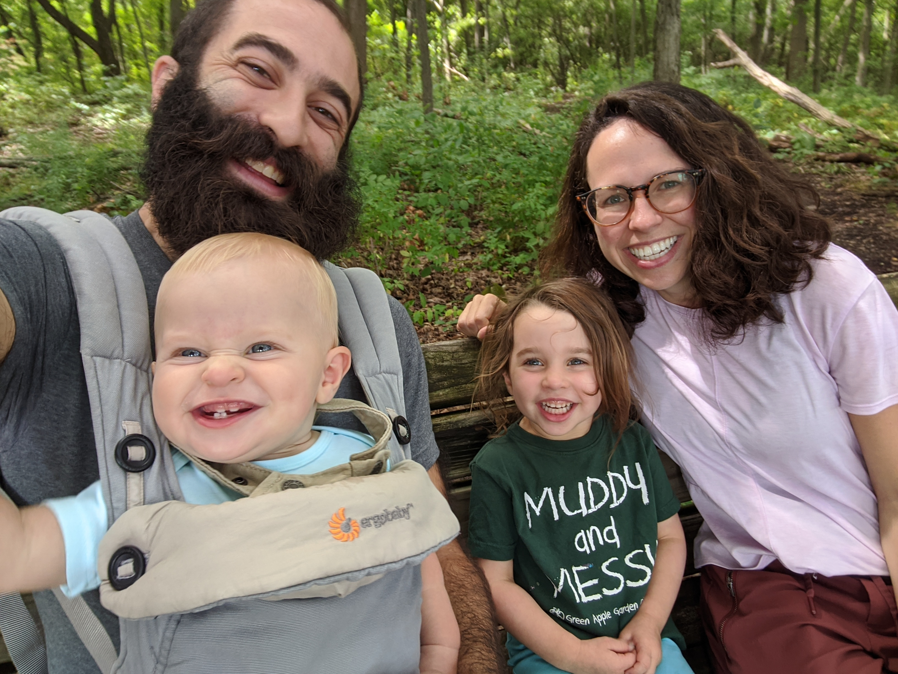

Me (left) with my partner and kids at the Dolph Nature Area in Ann Arbor, MI.

I am a postdoctoral research fellow at the University of Michigan, Ann Arbor. I spend my time thinking about how things you wouldn't typically consider fluids flow - marbles, ice, and even the Earth's mantle - and use computational models of varying complexity to test the boudaries between what we think should happen and what we see happening. I'm particularly interested in applying this to understand the processes that are currently driving sea levels to rise across the globe. I'm also interested in using the results of our computations to inform our actions and to better live with the environment and each other.

I'm semi-competent in a handful of instruments, including piano, fiddle, and guitar. I most enjoy playing classical and folk music and rewriting words to Pete Seeger songs.
